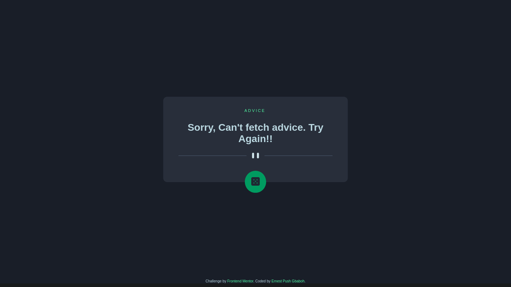
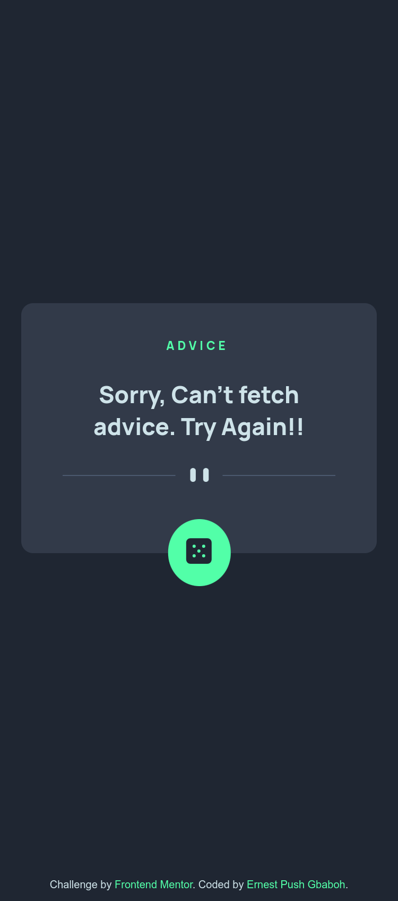

# Frontend Mentor - Advice generator app solution

This is a solution to the [Advice generator app challenge on Frontend Mentor](https://www.frontendmentor.io/challenges/advice-generator-app-QdUG-13db). Frontend Mentor challenges help you improve your coding skills by building realistic projects.

## Table of contents

- [Overview](#overview)
  - [The challenge](#the-challenge)
  - [Screenshot](#screenshot)
  - [Link](#links)
- [My process](#my-process)
  - [Built with](#built-with)
  - [What I learned](#what-i-learned)
- [Author](#author)

## Overview

### The challenge

Users should be able to:

- View the optimal layout for the app depending on their device's screen size
- See hover states for all interactive elements on the page
- Generate a new piece of advice by clicking the dice icon

### Screenshot




### Link

- Live Site URL: [Advice-app](https://app-advice-generator-fem.netlify.app)

## My process

### Built with

- Semantic HTML5 markup
- Scss & CSS custom properties
- Flexbox
- Mobile-first workflow
- Vanilla Js
- Fetch API & Async await

### What I learned

I learned how to use the fetch API with async and await to fetch data from an external resource and output the result in the DOM. Asynchronous Javascript is a key concept to learn in Javascript, and I am glad I was able to implement it in this project and get a good grasp of it. Using the async keyword, I was a able to turn an ordinary function into an asynchronous function. With the await keyword, I was able to tell Javascript to wait while my data is fetch using the fetch api, which in turn return a promise.

**Code snippets**

```js
const fetchAdvice = async () => {
  const timestamp = Date.now();
  const urlWithTimestamp = `${adviceSlipAPI}?timestamp=${timestamp}`;
  try {
    const response = await fetch(urlWithTimestamp);
    const data = await response.json();
    return data;
  } catch (error) {
    throw new Error("Sorry, Can't fetch advice. Try Again!!");
  }
};
```

```scss
&__button {
  border-radius: 100%;
  padding: u.rem(17.6);
  background: var(--NeonGreen);
  position: absolute;
  left: 50%;
  transform: translateX(-50%);
  cursor: pointer;

  &:hover {
    box-shadow: 1px 0px 22px 1px var(--NeonGreen);
  }
}
```

## Author

- Frontend Mentor - [@gbabohernest](https://www.frontendmentor.io/profile/gbabohernest)
- Twitter - [@gbaboh_dev](https://twitter.com/gbaboh_dev)
