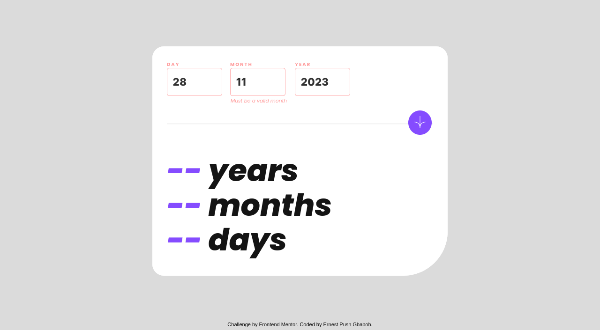
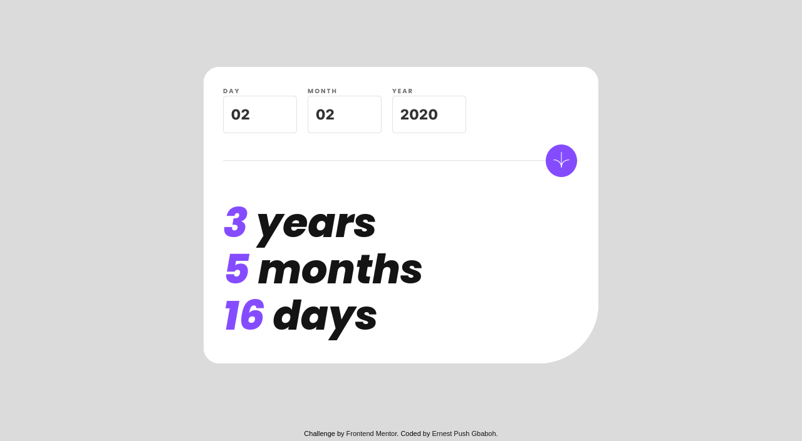
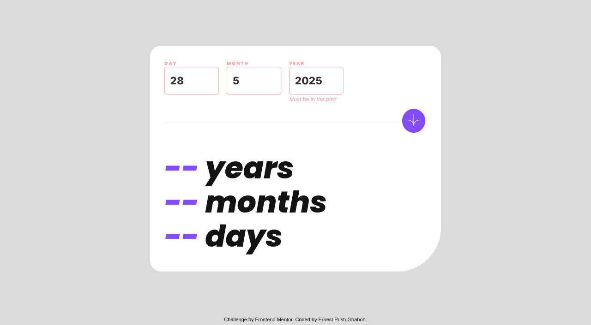
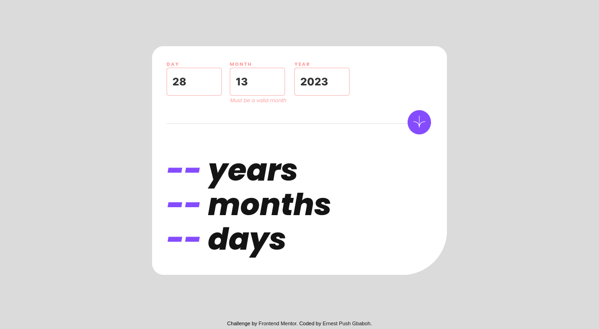

# Frontend Mentor - Age calculator app solution

This is a solution to the [Age calculator app challenge on Frontend Mentor](https://www.frontendmentor.io/challenges/age-calculator-app-dF9DFFpj-Q). Frontend Mentor challenges help you improve your coding skills by building realistic projects.

## Table of contents

- [Overview](#overview)
  - [The challenge](#the-challenge)
  - [Screenshot](#screenshot)
  - [Link](#links)
- [My process](#my-process)
  - [Built with](#built-with)
  - [What I learned](#what-i-learned)
  - [Continued development](#continued-development)
- [Author](#author)

## Overview

### The challenge

Users should be able to:

- View an age in years, months, and days after submitting a valid date through the form
- Receive validation errors if:
  - Any field is empty when the form is submitted
  - The day number is not between 1-31
  - The month number is not between 1-12
  - The year is in the future
  - The date is invalid e.g. 31/04/1991 (there are 30 days in April)
- View the optimal layout for the interface depending on their device's screen size
- See hover and focus states for all interactive elements on the page
- **Bonus**: See the age numbers animate to their final number when the form is submitted

### Screenshot










### Link

- Live Site URL: [app-age-calculator](https://app-age-calculator.netlify.app/)

## My process

### Built with

- Semantic HTML5 markup
- CSS custom properties
- Flexbox
- Mobile-first workflow
- Vanilla JavaScript

### What I learned

I learned about code organization, working with functions in Javascript. I also learned how to work with class and how to use the this keyword.

**Javascript code snippets of how I was able to make the age values to animate**

```js
  //! Animate the age values in the DOM
  animateAgeValues(startingAge, age, arrOfElements, duration = 1000) {
    let startTimestamp = null;
    const step = (timestamp) => {
      if (!startTimestamp) startTimestamp = timestamp;
      const progress = Math.min((timestamp - startTimestamp) / duration, 1);
      arrOfElements.forEach((element, index) => {
        element.textContent = Math.floor(
          progress * (age[index] - startingAge) + startingAge
        );
      });
      if (progress < 1) {
        window.requestAnimationFrame(step);
      }
    };

    window.requestAnimationFrame(step);
  }

```

### Continued development

Going forward, I'd like to work on implementing more advance concepts of the Javascript language in future projects. Concepts like how to work fetch extended data from an API and use that data inside an application amongst others.

## Author

- Frontend Mentor - [@gbabohernest](https://www.frontendmentor.io/profile/gbabohernest)
- Twitter - [@gbaboh_dev](https://twitter.com/gbaboh_dev)
