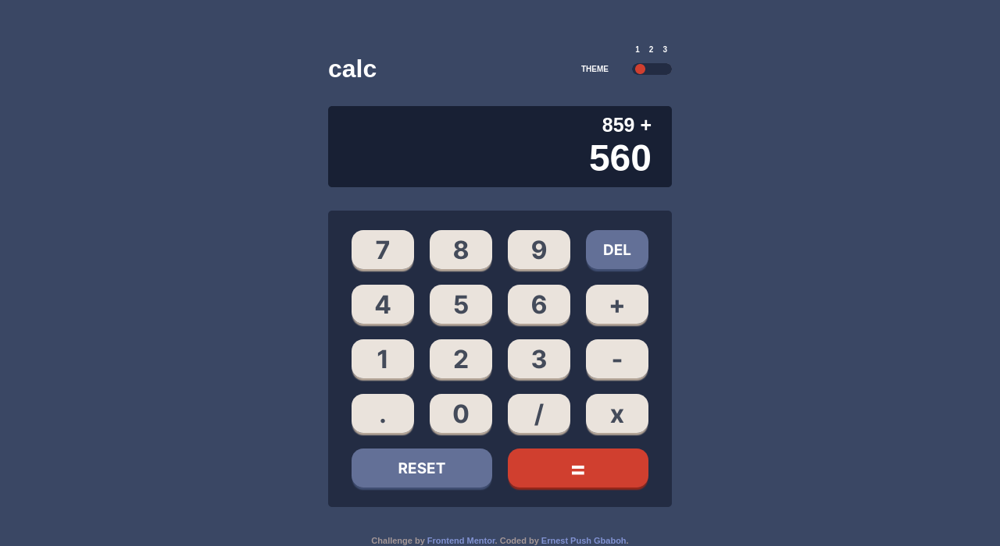
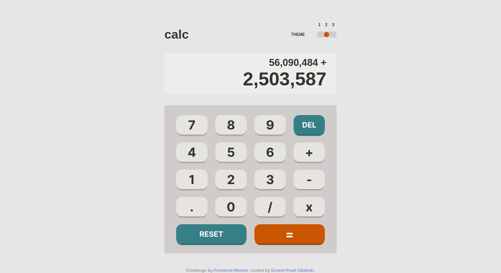
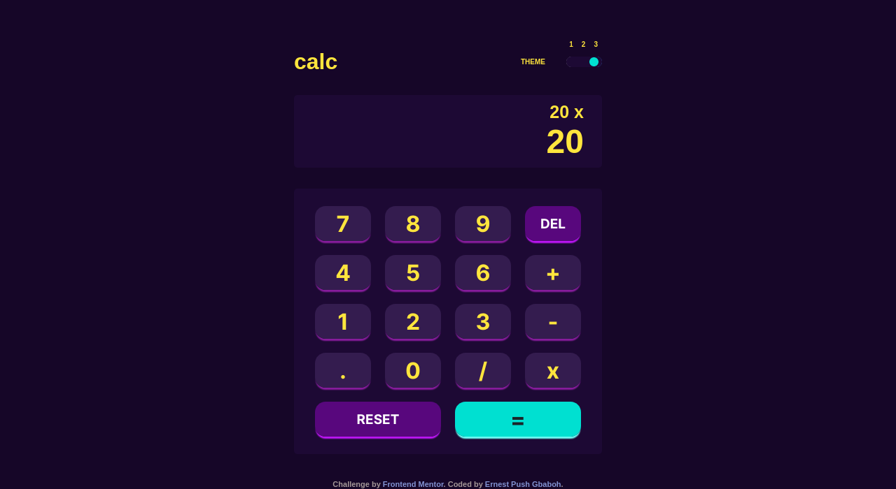

# Frontend Mentor - Calculator app solution

This is a solution to the [Calculator app challenge on Frontend Mentor](https://www.frontendmentor.io/challenges/calculator-app-9lteq5N29). Frontend Mentor challenges help you improve your coding skills by building realistic projects.

## Table of contents

- [Overview](#overview)
  - [The challenge](#the-challenge)
  - [Screenshot](#screenshot)
  - [Links](#links)
- [My process](#my-process)
  - [Built with](#built-with)
- [Author](#author)

## Overview

### The challenge

Users should be able to:

- See the size of the elements adjust based on their device's screen size
- Perform mathematical operations like addition, subtraction, multiplication, and division
- Adjust the color theme based on their preference
- **Bonus**: Have their initial theme preference checked using `prefers-color-scheme` and have any additional changes saved in the browser

### Screenshot





### Links

- Solution URL: [calculator-app](https://github.com/gbabohernest/100-Days-of-Code/tree/main/Practice%20Projects/calculator-app-main)
- Live Site URL: [basic-mode-cal-app](https://basic-mode-calculator-app.netlify.app)

## My process

### Built with

- Semantic HTML5 markup
- CSS custom properties
- Flexbox
- CSS Grid
- Mobile-first workflow
- Vanilla JavaScript

```scss
@include u.breakpointsUp(medium) {
  @include u.grid-cal(4, u.rem(100), 5, u.rem(70));
}
.span-two {
  grid-column: span 2;
}
```

```js
 formatDisplay(number) {
    const num = number.toString();
    const intDigits = parseFloat(num.split(".")[0]);
    const decimalDigits = num.split(".")[1];
    let intDisplay;

    if (isNaN(intDigits)) {
      intDisplay = "";
    } else {
      intDisplay = intDigits.toLocaleString("en", { maximumFractionDigits: 0 });
    }
    if (decimalDigits != null) {
      return `${intDisplay}.${decimalDigits}`;
    } else {
      return intDisplay;
    }
  }

```

## Author

- Frontend Mentor - [@gbabohernest](https://www.frontendmentor.io/profile/gbabohernest)
- Twitter - [@gbaboh_dev](https://twitter.com/gbaboh_dev)
