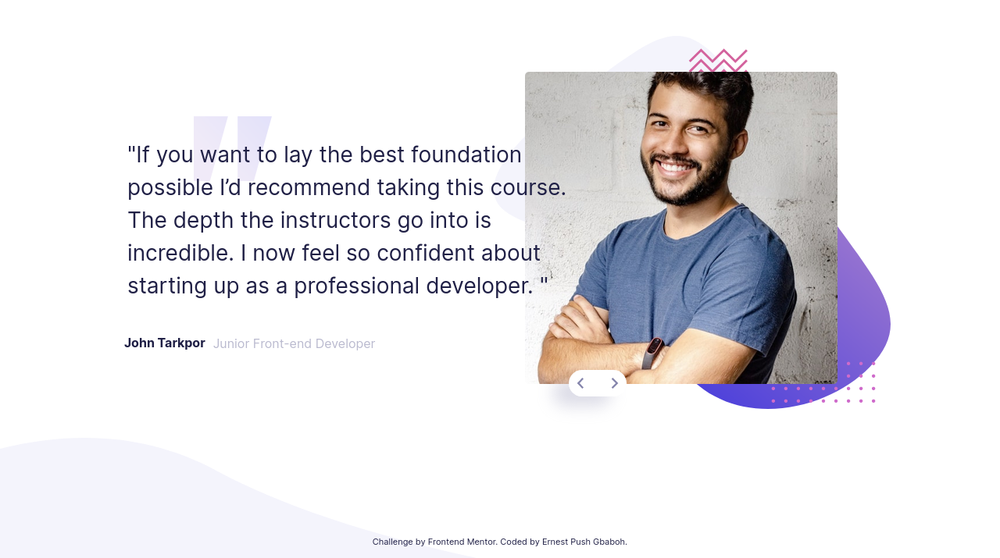

# Frontend Mentor - Coding bootcamp testimonials slider solution

This is a solution to the [Coding bootcamp testimonials slider challenge on Frontend Mentor](https://www.frontendmentor.io/challenges/coding-bootcamp-testimonials-slider-4FNyLA8JL). Frontend Mentor challenges help you improve your coding skills by building realistic projects.

## Table of contents

- [Overview](#overview)
  - [The challenge](#the-challenge)
  - [Screenshot](#screenshot)
  - [Links](#links)
- [My process](#my-process)
  - [Built with](#built-with)
  - [Code snippets](#Code-snippets)
  - [Continued development](#continued-development)
- [Author](#author)

**Note: Delete this note and update the table of contents based on what sections you keep.**

## Overview

### The challenge

Users should be able to:

- View the optimal layout for the component depending on their device's screen size
- Navigate the slider using either their mouse/trackpad or keyboard

### Screenshot




### Links

- Live Site URL: [js-testimonials-slider](https://js-testimonials-slider.netlify.app/)

## My process

### Built with

- Semantic HTML5 markup
- Flexbox
- Scss
- Mobile-first workflow
- Vanilla JavaScript

### Code snippets

```scss
$breakpoints-down: (
  //767.98px 1139.98px
  "small": f.em(767.98),
  "small-down": f.em(1139.98)
);

@mixin breakpoints-up($size) {
  @media screen and (min-width: map-get($breakpoints-up, $size)) {
    @content;
  }
}
```

```js
btns.forEach((btn) => {
  btn.addEventListener("click", (e) => {
    const target = e.currentTarget.classList;

    if (target.contains("next")) {
      currentTestimonial++;
      if (currentTestimonial > testimonials.length - 1) {
        currentTestimonial = 0;
      }
      showTestimonials();
    } else {
      currentTestimonial--;
      if (currentTestimonial < 0) {
        currentTestimonial = testimonials.length - 1;
      }
      showTestimonials();
    }
  });
});
```

### Continued development

Going forward, I want to continue building more javascript projects to improve my skills and also improve my knowledge in the advance concepts of the language.

## Author

- Frontend Mentor - [@gbabohernest](https://www.frontendmentor.io/profile/gbabohernest)
- Twitter - [@gbaboh_dev](https://twitter.com/gbaboh_dev)
