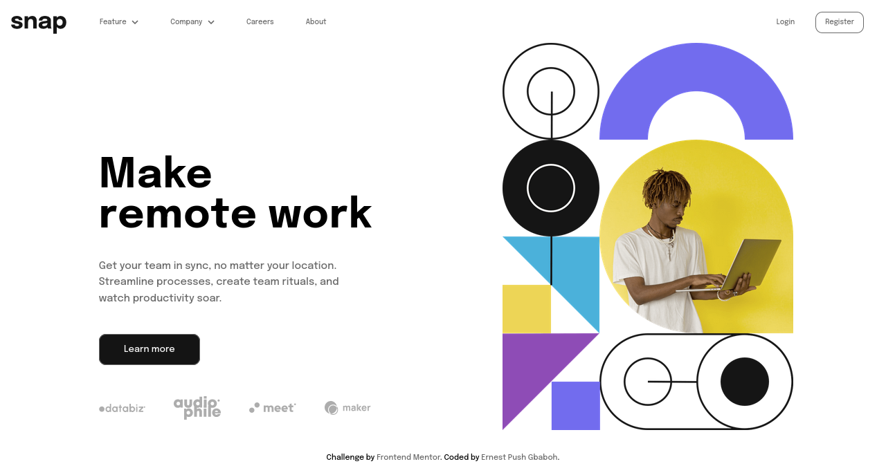
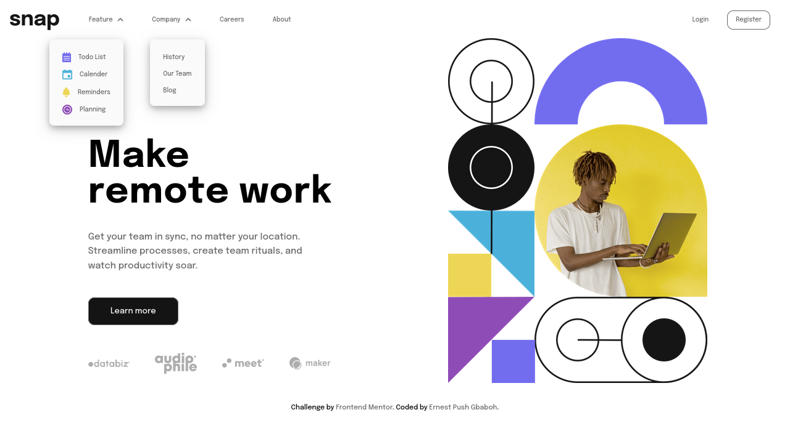
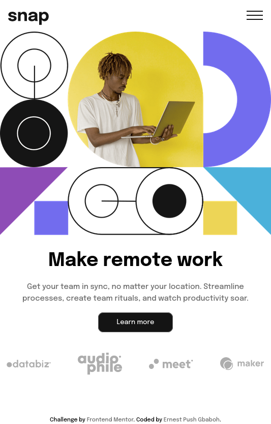
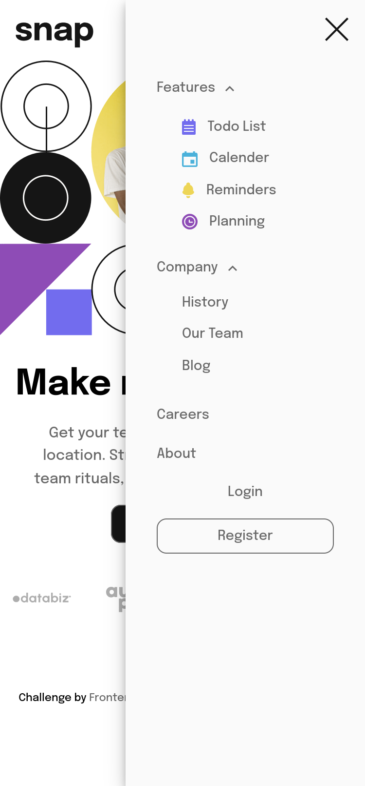

# Frontend Mentor - Intro section with dropdown navigation solution

This is a solution to the [Intro section with dropdown navigation challenge on Frontend Mentor](https://www.frontendmentor.io/challenges/intro-section-with-dropdown-navigation-ryaPetHE5). Frontend Mentor challenges help you improve your coding skills by building realistic projects.

## Table of contents

- [Overview](#overview)
  - [The challenge](#the-challenge)
  - [Screenshot](#screenshot)
  - [Link](#link)
- [My process](#my-process)
  - [Built with](#built-with)
  - [Some code snippets](#some-code-snippets)
- [Author](#author)

## Overview

### The challenge

Users should be able to:

- View the relevant dropdown menus on desktop and mobile when interacting with the navigation links
- View the optimal layout for the content depending on their device's screen size
- See hover states for all interactive elements on the page

### Screenshot






### Link

- Live Site URL: [Add live site URL here](https://intro-section-js.netlify.app)

## My process

### Built with

- Semantic HTML5 markup
- CSS custom properties
- Flexbox
- CSS Grid
- Mobile-first workflow
- Vanilla JS

### Some Code Snippets

```scss
%sub-menu {
  position: absolute;
  top: 64px;
  border: 1px solid var(--almost-white);
  border-radius: 0.5rem;
  padding: 1.25rem 1.25rem 0.3125rem;
  background: var(--almost-white);
  box-shadow: 0 4px 8px 0 rgba(0, 0, 0, 0.2), 0 6px 20px 0 rgba(0, 0, 0, 0.19);
  cursor: pointer;

  @include b.breakpoints-down(medium) {
    display: none;
  }
  p {
    font-size: 0.625rem;
    color: var(--medium-gray);
  }
}

%sub-menu-list-item {
  display: flex;
  align-items: center;
  padding-bottom: 0.75rem;
  gap: 0.75rem;
}
%border {
  border: 1px solid var(--medium-gray);
  padding: 0.4375rem 0.8125rem;
  border-radius: 0.625rem;
}

%hover {
  color: var(--almost-black);
  transition: all 0.3s ease-in-out;
}
```

```js
  if (menuItem.classList.contains('company')) {
      img.forEach((img) => {
        if (!img.classList.contains('close-btn')) {
          img.classList.add('close-btn');

          if (subMenu1.classList.contains('display-none')) {
            subMenu2.classList.toggle('top-158');
          } else if (!subMenu1.classList.contains('display-none')) {
            //? adjust the position of the drop down list items
            subMenu2.classList.toggle('top-300');
          }
          subMenu2.classList.toggle('display-none');
          listItem2.classList.toggle('mb2');
        } else {
          img.classList.remove('close-btn');
        }
      });
    }
};
```

## Author

- Frontend Mentor - [@gbabohernest](https://www.frontendmentor.io/profile/gbabohernest)
- Twitter - [@gbaboh_dev](https://twitter.com/gbaboh_dev)
