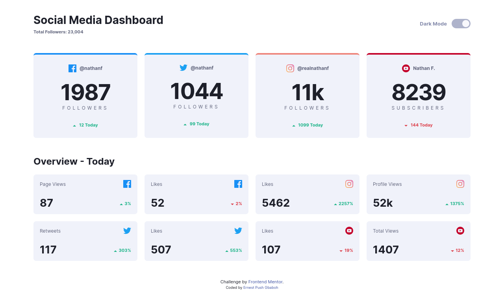
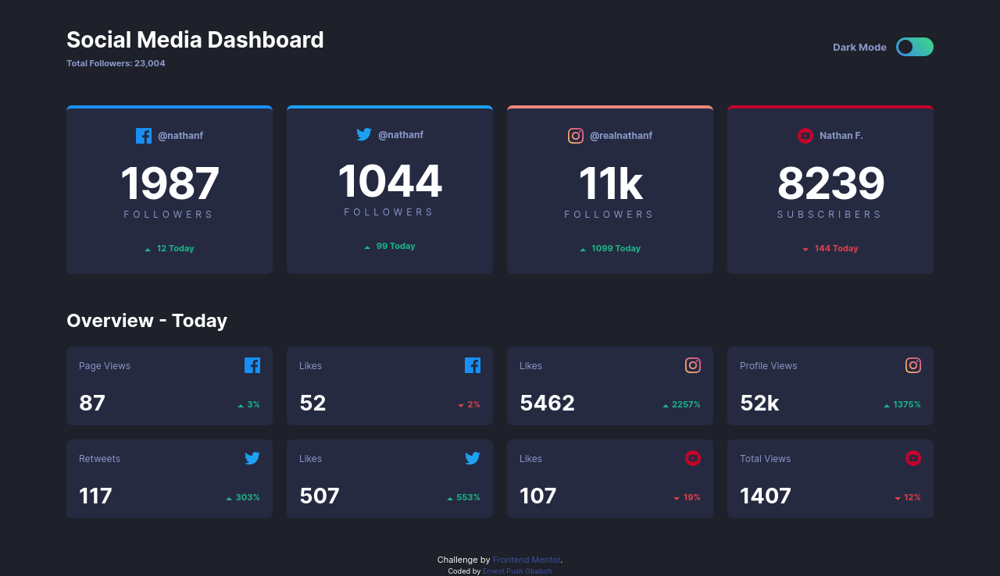

# Frontend Mentor - Social media dashboard with theme switcher solution

This is a solution to the [Social media dashboard with theme switcher challenge on Frontend Mentor](https://www.frontendmentor.io/challenges/social-media-dashboard-with-theme-switcher-6oY8ozp_H). Frontend Mentor challenges help you improve your coding skills by building realistic projects.

## Table of contents

- [The challenge](#the-challenge)
- [Screenshot](#screenshot)
- [Links](#links)
- [My process](#my-process)
  - [Built with](#built-with)
  - [What I learned](#what-i-learned)
- [Author](#author)

### The challenge

Users should be able to:

- View the optimal layout for the site depending on their device's screen size
- See hover states for all interactive elements on the page
- Toggle color theme to their preference

### Screenshot

- checkout the screenshots for both light and dark mode




### Links

- Solution URL: [social-media-dashboard-with-theme-switcher-master](https://github.com/gbabohernest/100-Days-of-Code/tree/main/Practice%20Projects/social-media-dashboard-with-theme-switcher-master)
- Live Site URL: [theme-switcher-social-dashboard](https://theme-switcher-social-dashboard.netlify.app/)

## My process

### Built with

- Semantic HTML5 markup
- Mobile-first workflow
- css custom properties
- Scss
- Flexbox
- CSS Grid
- JavaScript

### What I learned

Before this project I have not use or heard about prefer-color-scheme media query. while working on this project, I was able to learn about it and how to use it. Using prefer-color-scheme media query we can detect and respond to the user's preferred color scheme or color mode on their device. With this information, we can apply different styles for change the color of elements on the page based on whether the user prefers a light or dark color scheme.

```scss
@function rem($pixel) {
  @if math.is-unitless($pixel) {
    @return math.div($pixel, 16) + rem;
  } @else {
    @error "Don't use a unit when using the rem function!";
  }
}
```

```js
window
  .matchMedia("(prefers-color-scheme: dark)")
  .addEventListener("change", (e) => {
    const selectedMode = e.matches;
    if (selectedMode) {
      dark.checked = true;
      applyColorThemeMode("dark");
    } else {
      light.checked = true;
      applyColorThemeMode("light");
    }
  });
```

## Author

- Frontend Mentor - [@gbabohernest](https://www.frontendmentor.io/profile/gbabohernest)
- Twitter - [@gbaboh_dev](https://twitter.com/gbaboh_dev)
